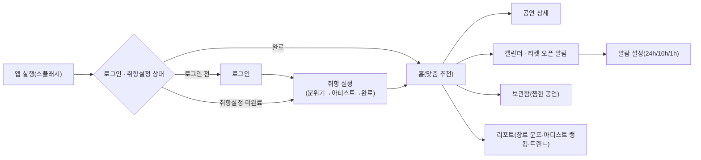

# 🎫 NOLI — 취향 기반 공연 큐레이션 앱

> 일상에 문화를 더하다, NOLI — 내 취향에 맞는 공연을 추천받고, 티켓 오픈을 놓치지 않고, 관람 기록을 리포트로 남기는 앱

<p>
  
  
  
  
  
</p>

## 🖼️ 구현 결과
| 취향 맞춤 홈 화면 | 티켓 오픈 알림 설정 | 나의 관람 리포트 |
|---|---|---|
|  |  |  |

배포 링크: [ticket-puce-seven.vercel.app](https://ticket-puce-seven.vercel.app/) · [GitHub Repo](https://github.com/seochaewon11/ticket) · [Design (Figma)](https://www.figma.com/design/ou0DQ3A12frTOFM87hJtic/noli_app?node-id=0-1&t=JaLOcqm54swMnlEJ-1) · [Notefolio](https://notefolio.net/chaenote/466161) · [Notion 기획서](https://app.notion.com/p/Project1_NOLI-5203cdc6ec6443f9adb0d1cd6f90ae46?source=copy_link)

## ✨ 주요 기능 & 인터랙션

### 1. 취향 기반 맞춤 공연 추천
로그인 후 분위기·장르 선택 → 좋아하는 아티스트 검색 → 완료 확인까지 3단계로 이어지는 취향 설정을 마치면, 홈 화면 상단에 "OOO님을 위한 맞춤 추천" 캐러셀이 노출됩니다. 전체 공연 중 취향 일치도(matchRate)가 70% 이상인 공연만 추천 목록에 걸러 보여줘, 관심 없는 공연을 넘기며 스크롤을 낭비하지 않도록 했습니다. 공연 카드의 하트(찜) 버튼은 화면 간에 공유되는 전역 상태로 관리해, 메인이든 상세 화면이든 어디서 눌러도 보관함의 "저장한 공연" 목록에 바로 반영됩니다.

### 2. 티켓 오픈 알림
캘린더 화면의 "티켓 오픈 알림" 카드에서 알람 아이콘을 누르면, 24시간 전 / 10시간 전 / 1시간 전 중 원하는 시점을 **중복 선택**할 수 있는 알람 설정 화면으로 이동합니다. 오픈일이 임박한 카드(D-3 이내)는 붉은 계열로 강조 표시해, 여러 공연의 예매 일정을 한눈에 훑어도 놓치면 안 되는 티켓을 바로 구분할 수 있게 했습니다.

### 3. 나의 관람 리포트
지난 6개월간의 관람 트렌드 꺾은선 그래프, 장르별 관람 비중 도넛 차트, 최다 관람 아티스트 랭킹을 리포트 화면 하나에서 모아 볼 수 있습니다. "리포트 친구에게 공유하기" 버튼을 누르면 이 기록을 그대로 캡처해 공유할 수 있어, 개인 기록으로만 남기지 않고 SNS 인증처럼 퍼뜨릴 수 있게 했습니다.

## 🧭 사용자 플로우


## 🗂️ 폴더 구조
```
src/
├── components/          # 화면별 프레젠테이션 컴포넌트 (alarm, calendar, detail, favorite, main, profile, report, storage, common)
├── pages/               # 라우트 단위 페이지 (Splash, Login, Favorite, Main, Detail, Calendar, TicketAlarms, Alarm, Storage, Report, Profile ...)
├── context/             # AppStateContext(세션·취향설정·찜 전역 상태), SearchOverlayContext, ShareSheetContext
├── data/                # 화면에 쓰이는 mock 데이터 (공연, 아티스트, 알람, 리포트 통계 등)
├── router/
│   └── routes.ts        # 라우트 경로 상수 및 헬퍼
├── styles/              # 전역 스타일 · styled-components 테마
└── types/               # 공용 타입 정의
```

## 🤖 AI 활용 프로세스
이 프로젝트는 기획 초안부터 코드 구현까지 각 단계에서 챗gpt를 1차 초안 생성 도구로 활용하고, 기획 단계 이후부터는 Antigravity(Claude)를 사용해 검증, 수정하는 방식으로 진행했습니다.

**① 기획 단계 — (챗GPT)**
> "내 앱 기획서야. 이를 분석해서 PL@Y2를 포함한 관련 어플 3개 정해줘."

AI는 처음에 인터파크 티켓, YES24 티켓, 멜론티켓 공연 예매/탐색 중심 앱들을 후보로 제시했지만, NOLI의 핵심이 "예매"가 아니라 "공연 기록·아카이빙"이라는 점을 짚어주며 분석 기준을 다시 잡아야 한다고 피드백했습니다. 이에 따라 예매 중심 앱(YES24, 멜론티켓)은 방향이 맞지 않아 제외하고, 최종적으로 PL@Y2(공연 탐색 및 기록),경쟁 서비스로 선정해 벤치마킹 포인트와 차별화 지점을 직접 정리했습니다.


**② 디자인 단계 — Stitch & 챗gpt**
> "내 앱 기획과 디자인이 잘 어울리는지 피드백 해줘." (기획서 전문 + 디자인 화면 첨부)

AI는 기획-디자인 일관성 자체는 높게 평가했지만, 다음과 같은 구체적인 갭을 짚어냈습니다.
- 앱의 핵심 가치인 '맞춤 공연 추천' 화면이 부각되지 않고, 통계/분석 화면 비중이 지나치게 큼
- MVP 핵심 기능인 '공연 플레이리스트(찜)' 기능이 UI상 거의 드러나지 않음
- Bottom Navigation 구성(Home/Explore/Calendar/Analysis)이 사용자에게 직관적이지 않음
- 홈 화면의 정보 밀도가 낮아 첫인상이 비어 보임

이 피드백을 반영해 Bottom Navigation을 캘린더 / 보관함 / 추천(중앙 강조 버튼) / 리포트 / 프로필로 재구성했습니다. 찜 기능은 '보관함' 탭으로 명확히 노출했습니다. 홈 화면에도 취향 일치도(%)와 맞춤 추천 공연 섹션을 상단에 크게 배치해, AI가 지적한 "추천 앱인데 추천 화면이 없다"는 문제를 개선했습니다.

레이아웃/디자인 생성 → Stitch AI (기본 레이아웃만 잡고, 이미지·공연 정보는 직접 수집)
기획-디자인 정합성 검증 → ChatGPT (완성된 디자인이 기획 의도와 맞는지 피드백 요청)

**③ 개발 단계 — 컴포넌트 초안 생성**
바닐라 JS 프로토타입(`org/` 폴더)을 React + TypeScript + Vite 구조로 이식하는 과정에서 Antigravity(Claude)로 컴포넌트 초안을 먼저 받았습니다.

> "퍼블리싱된 웹리소스를 리액트 프로젝트로 변환하는 작업을 진행할 거야. org 폴더는 퍼블리싱된 정적인 html, css, js 파일이 들어있는 디렉토리고, index.html, commend.html, splash.html 파일이 만들어져 있어. 전체 소스를 분석해서 아래 요구사항에 맞게 작업할 수 있도록 작업계획을 작성해줘. 작업계획은 md 파일로 저장해줘.
> - 원본 위치: org/
> - 프레임워크: React (Vite)
> - 언어: TypeScript
> - 라우터 경로: /
> - 컴포넌트 위치: src/components
> - 페이지 위치: src/pages
> - 헤더, 푸터 공통 컴포넌트 분리
> - CSS: 스타일 컴포넌트 분리
> - 작업계획서 파일명: 작업계획.md"

전체 이식 작업 전에 AI에게 먼저 작업계획(.md) 을 세우게 한 뒤, 계획을 검토·확정하고 나서 실제 컴포넌트 코드를 순차적으로 생성받는 방식으로 진행했습니다.

**④ 카피라이팅 — 화면 문구 다듬기**
> "온보딩 완료 화면에 들어갈 문구를 만들어줘.'오늘도 반가워요!', '좋아하는 아티스트가 있나요?' 같은 안내 문구 톤을 소개할 때 친근하고 따뜻한 느낌으로 3개 정도 후보를 줘."

AI가 제안한 문구 중 너무 길거나 딱딱한 표현은 제외하고, 서비스 톤(감성적·친근함)에 맞는 짧은 문구로 직접 수정했습니다.

**⑤ 트러블슈팅 — 원인 진단**
버그가 발생했을 때도 증상을 설명해 원인 후보를 먼저 받아본 뒤, 실제 원인을 좁혀 나갔습니다. (아래 트러블슈팅 표 참고)

> 전체 기획 단계(니즈분석·컨셉설정)의 프롬프트는 노션 기획서에서 더 자세히 볼 수 있습니다.

## 🩹 트러블슈팅
| 이슈 | 원인 | 해결 |
|---|---|---|
| Vercel 배포 후 새로고침 시 하위 라우트 404 | SPA 라우팅을 서버가 인식하지 못함 | `vercel.json`에 모든 경로를 `index.html`로 보내는 rewrite 규칙 추가 |
| 공연 찜(하트) 상태가 화면마다 따로 관리돼 보관함에 반영 안 됨 | 각 페이지 로컬 state로 분리 관리 | `AppStateContext`로 찜 상태를 전역화해 보관함 "저장한 공연" 목록과 동기화 |
| 로그인 화면 NOLI 로고가 저해상도로 흐리게 보임 | PNG 래스터 이미지 사용 | 벡터 SVG 로고로 교체 |
| 취향설정(카테고리·분위기) 선택이 메인 맞춤 추천에 실제로 반영되지 않음 | 추천 로직이 mock 데이터의 고정 `matchRate` 값만 참조 | 실제 연동을 시도했으나 부작용으로 되돌림 — 현재 진행 중인 이슈 |

## 📄 라이선스
MIT
